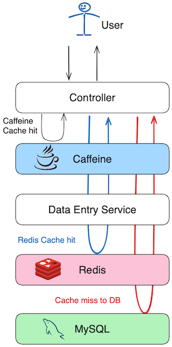

# Caching
This application utilizes two caching mechanisms for improved performance.



## Caffeine Cache on Controllers
At the controller level, when a user hits an endpoint, the result is cached in Caffeine. The purpose of this cache is to prevent the controller from processing the same requests repeatedly. It serves as a measure to protect the API service from being overwhelmed due to mistakes on the client side, DDoS attacks, etc.

### Configuration
```properties
spring.cache.caffeine.enabled=true
spring.cache.caffeine.spec=initialCapacity=10,maximumSize=50,expireAfterWrite=10s 
```

## Redis Cache on Data Entry Service (DB Access)
The purpose of this cache layer is to minimize database access. In a large application with multiple VM instances, the database could be heavily hit when the application connects to a large number of clients. Caching at this layer aims to serve different clients from previously processed database queries. In practice, implementing this should go beyond simply adding the `@Cacheable` annotation for better optimization. For example, the current `DataEntryServiceImpl` class queries with a data range. Caching may be done per one day of data range. If the date range for a whole month is requested, a partial set of data for a few dates may be returned from the cache, while dates that are not in the cache will go to the database.

### Configuration
```properties
spring.cache.redis.enabled=true
spring.cache.redis.host=localhost
spring.cache.redis.port=6379
spring.cache.redis.time-to-live=60000
```
