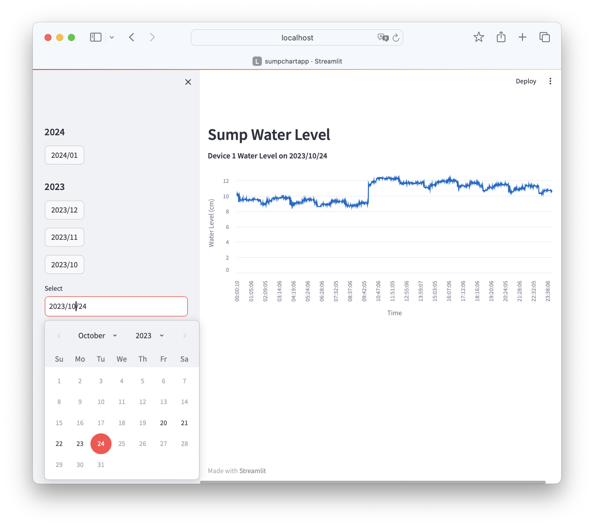

# REST API Server for IoT - Sump Water Level Application

[](https://github.com/ntamagawa/sumpdata/blob/main/LICENSE)

A showcase of a Java Spring Boot app that manages IoT device data via REST API. As a real-world application, this project is intended to collect water level data from [Raspi-Sump](https://www.linuxnorth.org/raspi-sump/) - a water level monitor using a Raspberry Pi.



`?` What is a sump pump? [Sump pump](https://en.wikipedia.org/wiki/Sump_pump) (Wikipadia)

## Motivation
I wanted to demonstrate Spring Boot capabilities that can be used for a scalable web server. I chose the water level data from [Raspi-Sump](https://www.linuxnorth.org/raspi-sump/) - _real data_ from my house's sump. Raspi-Sump has a built-in web server, and the motivation is to build a service that supports thousands of such data sources and helps visualize.

## Features
* CRUD operation for singly data entry
  * One API call per data point. This will work nicely with Raspi-Sump as it generates one water level data point per minute. 
* Bulk upload of data
  * Raspi-Sump creates a CSV file per day. Bulk upload feature can be used to back-fill data
* Scalable options (To be implemented)
  * Asynchronous bulk upload operation - CSV files can be uploaded but the client doesn't need to wait for them to be processed. Technology used : Kafka
  * Read operation can be cached : Technology used : Caffeine cache, Redis
  * Read-only database replica support.

## Data Visualization
Using the REST API, any frontend framework would work to visualize the water level data. As I'm a backend-focused developer, the visualization is done using [Streamlit](https://streamlit.io), an easy-to-use chart framework. The project can be found in [my SumpChart repo](https://github.com/ntamagawa/sumpchart).

## REST API
The API supports 2 resources, `entries` and `devices`. `entries` endpoint is to operate data entries from Raspi-Sump. `devices` endpoint supports `list` operation to obtain available data entries for a device.

### Add a single data entry
Use `POST` with a single JSON data entry (`application/json`). The endpoint also supports `text/plain` with query parameters, so the client doesn't need to build a JSON object.

JSON example: 
```shell
curl -X POST 'http://localhost:8080/devices/1/entries' \
-d '{"deviceID":1,"measuredOn":"2023-10-23T16:37:06","value":122}' \
-H 'Content-Type: application/json' 
```

Query Param example:
```shell
curl -X POST 'http://localhost:8080/devices/1/entries?measuredOn=2023-10-24T16:37:06&value=12.2'\
 -H 'Content-Type: text/plain'
```

### Bulk Upload
To upload csv file(s), use `POST` request to the device's `entries` endpoint. This bulk operation can be used for a back-fill purpose. The uploaded file name has to have a suffix of `-YYYYMMDD` format to specify the date of the data entry, and each line in the file should contain `HH:MM:SS,value` format, where the value is a decimal (in cm) for the depth of the water level. This filename and format convention are standard for Raspi-Sump.
```shell
curl 'http://localhost:8080/devices/1/entries' --X POST \
-F files=@waterlevel-20230801.csv \
-F files=@waterlevel-20230802.csv
```
Data sample:
```
2023-08-07T00:00:10,10.0
2023-08-07T00:01:06,9.8
2023-08-07T00:02:05,9.7
2023-08-07T00:03:05,9.8
```

## Development and Operations
For detailed development environment set up steps, and tips for the actual operations of the server environment, see [Development and Operations](DEVOPS.md) 

## TODOs
* REST API documentation - considering Swagger
* Security
  * Authentication access
* Improve `devices` endpoint
  * Add CRUD operations for devices
  * Meta data support for devices  

## License
This software is released under the [MIT License](https://github.com/ntamagawa/sumpdata/blob/main/LICENSE).